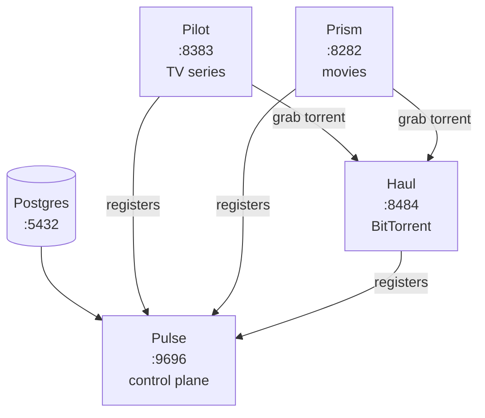

# Beacon Stack — Deploy

Docker Compose deployment for the full Beacon media management stack. Clone the repo, run one command, done.

[](LICENSE)
[](https://docs.docker.com/get-docker/)
[](https://beaconstack.io)

[Quick start](#quick-start) · [Services](#services) · [Enabling VPN](#enabling-vpn) · [Configuration](#configuration) · [Troubleshooting](#troubleshooting)

---

## What's in the stack

| Service | Purpose |
|---|---|
| **Postgres** | Shared database for all Beacon apps |
| **Pulse** | Control plane — manages indexers, quality profiles, and settings shared across all apps |
| **Pilot** | TV series manager — monitors episodes, scores releases, and kicks off grabs |
| **Prism** | Movie collection manager — edition-aware release scoring, Radarr v3 API compatible |
| **Haul** | BitTorrent client with stall detection and a VPN-aware dashboard |
| _Gluetun_ | Optional — VPN tunnel for Haul. See [Enabling VPN](#enabling-vpn). |
| _FlareSolverr_ | Optional — Cloudflare challenge solver. See [FlareSolverr](#flaresolverr). |

### Data flow



Pulse is the hub. Pilot, Prism, and Haul all register with it on startup and pull shared indexers and quality profiles. When Pilot or Prism grabs a release, the torrent goes to Haul.

---

## Quick start

**Prerequisites:** Docker Engine 24+ and Docker Compose v2.20+, 2 GB available RAM.

```bash
git clone https://github.com/beacon-stack/deploy.git
cd deploy
docker compose up -d
```

That's it. On first start, an `init-secrets` sidecar generates random database passwords into a dedicated Docker volume, Postgres initializes with a user+db per app, and the four Beacon apps start up and register with Pulse. No pre-setup scripts to run, no `.env` to edit for defaults.

**Verify:**

```bash
docker compose ps
```

Everything should show `healthy`:

- Pulse → [http://localhost:9696](http://localhost:9696)
- Pilot → [http://localhost:8383](http://localhost:8383)
- Prism → [http://localhost:8282](http://localhost:8282)
- Haul → [http://localhost:8484](http://localhost:8484)

Each app generates an API key on first run; find it in Settings.

---

## Services

| Service | Purpose | Default port | URL |
|---|---|---|---|
| Pulse | Control plane — indexers, quality profiles, shared settings | 9696 | [localhost:9696](http://localhost:9696) |
| Pilot | TV series management | 8383 | [localhost:8383](http://localhost:8383) |
| Prism | Movie collection management | 8282 | [localhost:8282](http://localhost:8282) |
| Haul | BitTorrent client | 8484 | [localhost:8484](http://localhost:8484) |

---

## Connecting the apps

After the stack is up, two things to wire manually through the UIs:

**1. Add Haul as a download client in Pilot and Prism.**

In each app's Settings, add a download client with URL `http://haul:8484` and the API key from Haul's Settings page. (If you've enabled the VPN override, use `http://vpn:8484` instead — see [Enabling VPN](#enabling-vpn).)

**2. Indexers and quality profiles flow automatically through Pulse.**

Pilot, Prism, and Haul register with Pulse on startup. Add indexers in Pulse's web UI and they're available to every registered service immediately.

---

## Enabling VPN

VPN is off by default. To route Haul's torrent traffic through [Gluetun](https://github.com/qdm12/gluetun):

**1. Set VPN credentials in `.env`:**

```env
VPN_USERNAME=your-vpn-username
VPN_PASSWORD=your-vpn-password
COMPOSE_FILE=docker-compose.yml:docker-compose.vpn.yml
```

**2. Apply:**

```bash
docker compose up -d
```

(The `COMPOSE_FILE` line makes plain `docker compose` pick up the VPN override automatically. Without it, run with explicit `-f` flags every time: `docker compose -f docker-compose.yml -f docker-compose.vpn.yml up -d`.)

### Switching providers

Gluetun supports [30+ VPN providers](https://github.com/qdm12/gluetun-wiki/tree/main/setup/providers). The defaults below work for PIA; override any of them in `.env`:

```env
VPN_SERVICE_PROVIDER=private internet access   # or mullvad, nordvpn, surfshark, protonvpn
VPN_TYPE=openvpn                                # or wireguard
VPN_SERVER_REGIONS=Netherlands
VPN_PORT_FORWARDING=on                          # PIA and ProtonVPN support this
```

For WireGuard, set `VPN_TYPE=wireguard` and uncomment the `WIREGUARD_*` lines in `docker-compose.vpn.yml`.

### Disabling VPN

Remove the `COMPOSE_FILE` line from `.env` (or drop the `-f docker-compose.vpn.yml` from your command). Haul reattaches directly to the bridge network on the next `docker compose up -d`.

---

## Configuration

### Environment variables

The stack ships with defaults that work out of the box. Override them by creating a `.env`:

```bash
cp .env.example .env
# edit .env
```

Common overrides: port numbers, media paths, FlareSolverr URL, log levels. See `.env.example` for the full list with defaults.

### Secrets handling

DB passwords are generated on first run by the `init-secrets` sidecar and stored in a Docker-managed volume (`beacon-secrets`). They never appear in `.env`, `docker-compose.yml`, or `docker inspect` output.

| What | Where |
|---|---|
| Per-app DB passwords | `beacon-secrets` volume, mounted read-only at `/run/secrets/<app>.txt` |
| Postgres superuser password | Same — `/run/secrets/pg.txt` |
| VPN credentials | `VPN_USERNAME` / `VPN_PASSWORD` env vars (only needed when VPN override is active) |

To inspect a password (admin only):

```bash
docker run --rm -v beacon-secrets:/s alpine cat /s/pulse.txt
```

To rotate passwords: stop the stack, drop both volumes, start again. **All DB data is lost** — Postgres bakes the old password hashes into `pgdata`.

```bash
docker compose down -v
docker compose up -d
```

### Media paths

Default paths are relative to the deploy directory (`./data/downloads`, `./data/tv`, `./data/movies`). Override for NAS mounts or existing libraries:

```env
DOWNLOADS_PATH=/mnt/nas/downloads
TV_PATH=/mnt/nas/media/tv
MOVIES_PATH=/mnt/nas/media/movies
```

Pilot, Prism, and Haul all see `DOWNLOADS_PATH` so they can import or hardlink completed downloads.

---

## FlareSolverr

[FlareSolverr](https://github.com/FlareSolverr/FlareSolverr) is a Cloudflare challenge solver for indexers behind Cloudflare bot protection. Most users don't need it.

Enable it with `COMPOSE_PROFILES=flaresolverr` in `.env`, then:

```bash
docker compose up -d
```

In Pulse: Settings → FlareSolverr URL → `http://flaresolverr:8191`.

---

## Updating

```bash
docker compose pull
docker compose up -d
```

Each app runs its own database migrations on startup.

---

## Troubleshooting

**A service never goes healthy**
- `docker compose logs <service>` names the problem. Most common: Postgres still initializing (wait 30s), or Pulse can't see itself (restart; Goose migrations are idempotent).

**VPN won't connect** (when VPN override active)
- Check `VPN_USERNAME` and `VPN_PASSWORD` in `.env`.
- Confirm the provider name matches Gluetun's expected value — see the [Gluetun wiki](https://github.com/qdm12/gluetun-wiki/tree/main/setup/providers).
- `docker compose logs vpn`

**Haul can't reach Postgres or Pulse** (VPN override active)
- Haul shares Gluetun's network namespace. Gluetun is attached to `beacon-net` and its firewall allow-lists the bridge subnet via `FIREWALL_OUTBOUND_SUBNETS=172.28.0.0/16`.
- If you changed the `beacon-net` subnet, update `FIREWALL_OUTBOUND_SUBNETS` in `docker-compose.vpn.yml` to match.

**Port conflicts**
- If another host service uses 9696, 8383, 8282, or 8484, change the corresponding `*_PORT` variable in `.env`. Postgres is not published by default; uncomment the `ports:` block in `docker-compose.yml` to expose it.

**Starting over**
- `docker compose down -v` drops pgdata and beacon-secrets. Next `docker compose up -d` is a full fresh start. App configs under `${PULSE_CONFIG_PATH}` etc. are not in Docker volumes — delete them manually if you also want fresh API keys.

---

## Development

Clone this repo alongside `pulse/`, `pilot/`, `prism/`, `haul/` (i.e., all under one parent directory). The dev override builds each service from local source:

```bash
cp .env.dev.example .env
docker compose up -d --build
```

`docker-compose.dev.yml` adds `build: ../<repo>` to each service; `.env.dev.example` points config paths at `~/.config/beacon/*` and media at `/opt/media/*` so rebuilds don't wipe your UI settings.

Rebuild a single service after local changes:

```bash
docker compose build pilot && docker compose up -d pilot
```

To fall back to the published images, swap `.env` back to `.env.example` (or just delete `.env`).

---

## Privacy

No telemetry, no analytics, no crash reporting, no update checks. Every Beacon app makes outbound connections only to services you explicitly configure: TMDB for metadata, your indexers, your download clients, your media servers, and (optionally) your VPN tunnel. Credentials stay in your local database and Docker volumes.

## License

MIT — see [LICENSE](LICENSE).
