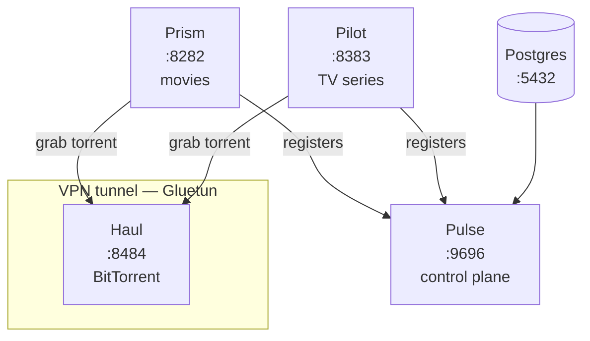

# Beacon Stack — Deploy

Docker Compose deployment for the full Beacon media management stack. Clone, configure, run one command.

[](LICENSE)
[](https://docs.docker.com/get-docker/)
[](https://beaconstack.io)

[Quick start](#quick-start) · [Services](#services) · [Configuration](#configuration) · [VPN](#vpn-configuration) · [Troubleshooting](#troubleshooting)

---

## What's in the stack

| Service | Purpose |
|---|---|
| **Postgres** | Shared database for all Beacon apps |
| **Pulse** | Control plane — manages indexers, quality profiles, and settings shared across all apps |
| **Pilot** | TV series manager — monitors episodes, scores releases, and kicks off grabs |
| **Prism** | Movie collection manager — edition-aware release scoring, Radarr v3 API compatible |
| **Haul** | BitTorrent client with stall detection and a VPN-aware dashboard |
| **Gluetun** | VPN tunnel — wraps Haul's network traffic, supports 30+ providers |

### Data flow



Pulse is the hub. Pilot and Prism register with it on startup and pull shared indexers and quality profiles. When either app grabs a release, the torrent goes to Haul, which runs inside the Gluetun VPN tunnel.

---

## Quick start

**Prerequisites:** Docker Engine 24+ and Docker Compose v2.20+, a VPN subscription ([or disable it](#disabling-vpn)), 2 GB available RAM.

**1. Clone this repo**

```bash
git clone https://github.com/beacon-stack/deploy.git
cd deploy
```

**2. Copy and edit the environment file**

```bash
cp .env.example .env
```

Open `.env` and set your VPN provider, server region, and media paths. The file has comments on every variable.

**3. Copy and edit the secret files**

```bash
cp secrets/pg-password.txt.example secrets/pg-password.txt
cp secrets/vpn-username.txt.example secrets/vpn-username.txt
cp secrets/vpn-password.txt.example secrets/vpn-password.txt
```

Replace the placeholder text in each file with your real values. No trailing newlines — use `echo -n "value" > secrets/file.txt` or a text editor that doesn't append one.

**4. Start the stack**

```bash
docker compose up -d
```

**5. Verify everything is healthy**

```bash
docker compose ps
```

What to expect: containers will start in dependency order. The VPN tunnel typically takes 30–60 seconds to establish before Haul comes up. Health checks run every 30 seconds. Once all services show `healthy`, the stack is ready.

---

## Services

| Service | Purpose | Default port | URL |
|---|---|---|---|
| Pulse | Control plane — indexers, quality profiles, shared settings | 9696 | [localhost:9696](http://localhost:9696) |
| Pilot | TV series management | 8383 | [localhost:8383](http://localhost:8383) |
| Prism | Movie collection management | 8282 | [localhost:8282](http://localhost:8282) |
| Haul | BitTorrent client | 8484 | [localhost:8484](http://localhost:8484) |

Each app generates an API key on first run. Find it in the app's Settings page.

---

## Connecting the apps

After first startup, two things need to be wired up manually:

**1. Add Haul as a download client in Pilot and Prism.**

In each app's Settings, add a download client with URL `http://vpn:8484` and the API key from Haul's Settings page. The hostname is `vpn` (not `haul`) because Haul runs inside the VPN container's network namespace and is only reachable through it.

**2. Indexers and quality profiles flow automatically through Pulse.**

If Pulse is running, Pilot and Prism registered with it on startup. Add your indexers in Pulse's web UI and they are available to every subscribed service immediately.

---

## Configuration

### Environment variables

All configurable values live in `.env`. The file is organized by service with comments explaining each variable. See `.env.example` for the full reference.

### Docker secrets

Passwords are stored in `secrets/*.txt` files, not in `.env`. Docker mounts these files into containers at `/run/secrets/` — they never appear in `docker inspect` output or the process environment.

| File | What goes in it |
|---|---|
| `secrets/pg-password.txt` | Postgres superuser password |
| `secrets/vpn-username.txt` | VPN username (OpenVPN) |
| `secrets/vpn-password.txt` | VPN password (OpenVPN) |

### Database passwords

The per-app database passwords (pulse/pilot/prism/haul) are set in two places: `docker-compose.yml` (the `DATABASE_DSN` environment variables) and `init-db.sql` (the `CREATE USER` statements). The defaults are the app name as the password — for example, user `pulse` with password `pulse`.

To change them, edit **both files** before the first `docker compose up`. After the first run, Postgres has already initialized the users. Changing passwords at that point requires dropping the volume and re-initializing — all data is lost:

```bash
docker compose down -v   # deletes pgdata — all data is lost
# Edit init-db.sql and docker-compose.yml with the new passwords
docker compose up -d
```

### Media paths

The default paths are relative to the deploy directory (`./data/downloads`, `./data/tv`, `./data/movies`), which makes the stack self-contained out of the box. Override them in `.env` for NAS mounts or existing media directories:

```env
DOWNLOADS_PATH=/mnt/nas/downloads
TV_PATH=/mnt/nas/media/tv
MOVIES_PATH=/mnt/nas/media/movies
```

Pilot, Prism, and Haul all mount `DOWNLOADS_PATH` so they can see completed downloads and import or hardlink them into the media directories.

---

## VPN configuration

The stack uses [Gluetun](https://github.com/qdm12/gluetun), which supports 30+ VPN providers. The default configuration is PIA (Private Internet Access) over OpenVPN.

### Switching providers

Set `VPN_SERVICE_PROVIDER` and the required auth variables in `.env`. Each provider has different requirements — see the [Gluetun wiki](https://github.com/qdm12/gluetun-wiki/tree/main/setup/providers) for your provider's page.

**PIA** (default):
```env
VPN_SERVICE_PROVIDER=private internet access
VPN_TYPE=openvpn
VPN_SERVER_REGIONS=Netherlands
VPN_PORT_FORWARDING=on
```

**Mullvad** (WireGuard):
```env
VPN_SERVICE_PROVIDER=mullvad
VPN_TYPE=wireguard
WIREGUARD_PRIVATE_KEY=your-key-here
WIREGUARD_ADDRESSES=10.x.x.x/32
VPN_SERVER_REGIONS=Netherlands
```

**NordVPN**:
```env
VPN_SERVICE_PROVIDER=nordvpn
VPN_TYPE=openvpn
VPN_SERVER_REGIONS=Netherlands
```

**ProtonVPN**:
```env
VPN_SERVICE_PROVIDER=protonvpn
VPN_TYPE=openvpn
VPN_SERVER_REGIONS=Netherlands
VPN_PORT_FORWARDING=on
```

**Surfshark**:
```env
VPN_SERVICE_PROVIDER=surfshark
VPN_TYPE=openvpn
VPN_SERVER_REGIONS=Netherlands
```

For WireGuard providers, uncomment the `WIREGUARD_*` lines in `docker-compose.yml` under the vpn service and set them in `.env`. The OpenVPN secret files can be left with placeholder values — Gluetun ignores them when using WireGuard.

### Port forwarding

VPN port forwarding allows incoming torrent connections, which improves download speeds and peer availability. PIA and ProtonVPN support it natively through Gluetun. Set `VPN_PORT_FORWARDING=on` in `.env`.

### Disabling VPN

If you don't need a VPN for torrent traffic, follow the instructions in the comment block above the `vpn` service in `docker-compose.yml`. The short version:

1. Comment out the entire `vpn` service block.
2. On the `haul` service, remove `network_mode: service:vpn`, remove `vpn` from `depends_on`, remove `extra_hosts`.
3. Add a `ports:` block to the `haul` service:
   ```yaml
   ports:
     - "${HAUL_PORT:-8484}:8484"
     - "${HAUL_PEER_PORT:-6881}:6881/tcp"
     - "${HAUL_PEER_PORT:-6881}:6881/udp"
   ```
4. The VPN entries in `.env` and `secrets/` can be left as-is.

---

## FlareSolverr

[FlareSolverr](https://github.com/FlareSolverr/FlareSolverr) is a Cloudflare challenge solver. It's useful if your indexers are behind Cloudflare's bot protection. Most users don't need it.

To start it alongside the main stack:

```bash
docker compose --profile flaresolverr up -d
```

Then configure the URL in Pulse: Settings → FlareSolverr URL → `http://flaresolverr:8191`.

---

## Updating

```bash
docker compose pull        # pull latest images for all services
docker compose up -d       # recreate containers with new images
```

Each app handles its own database migrations on startup — no manual schema changes needed.

---

## Troubleshooting

**VPN won't connect**
- Check your credentials in `secrets/vpn-username.txt` and `secrets/vpn-password.txt` — no trailing newlines
- Verify the provider name is spelled correctly in `.env` (must match Gluetun's expected value exactly)
- Check Gluetun logs: `docker compose logs vpn`

**Haul can't reach Postgres or Pulse**
- Haul shares the vpn container's network namespace. The vpn container is attached to the internal `beacon-net` bridge, and `FIREWALL_OUTBOUND_SUBNETS=172.28.0.0/16` on Gluetun allows outbound traffic to that subnet so Haul can reach `postgres` and `pulse` by service name without going through the tunnel.
- If you've changed the `beacon-net` subnet in `docker-compose.yml`, update `FIREWALL_OUTBOUND_SUBNETS` to match.
- Check Gluetun logs for firewall denials: `docker compose logs vpn | grep -i firewall`

**Database initialization failed**
- If the `pgdata` volume already exists from a previous run with different passwords, drop it: `docker compose down -v && docker compose up -d`
- Check Postgres logs: `docker compose logs postgres`

**Port conflicts**
- If another service already uses port 9696, 8383, 8282, or 8484, change the corresponding `*_PORT` variable in `.env`. Postgres is not published to the host by default; enabling the optional `ports:` block in `docker-compose.yml` brings `POSTGRES_PORT` into play.

**Permission errors on bind-mounted volumes**
- The Beacon app containers run as non-root users (UID 1000). Ensure the host directories in `DOWNLOADS_PATH`, `TV_PATH`, and `MOVIES_PATH` are writable by UID 1000, or adjust ownership: `sudo chown -R 1000:1000 ./data/`

---

## Privacy

No telemetry, no analytics, no crash reporting, no update checks. Every Beacon app makes outbound connections only to services you explicitly configure: TMDB for metadata, your indexers, your download clients, your media servers, and your VPN tunnel. Credentials stay in your local database and Docker secrets.

## License

MIT — see [LICENSE](LICENSE).
