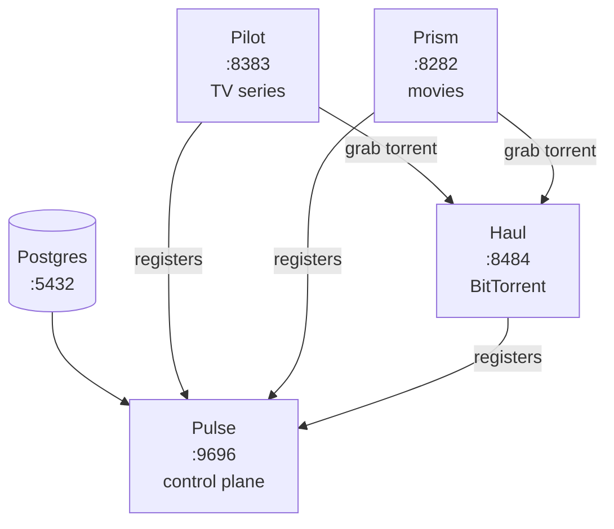

# Beacon Stack — Deploy

Docker Compose deployment for the full Beacon media management stack. Clone the repo, set three paths, run one command.

[](LICENSE)
[](https://docs.docker.com/get-docker/)
[](https://beaconstack.io)

[Quick start](#quick-start) · [Services](#services) · [Configuration](#configuration) · [Enabling VPN](#enabling-vpn) · [Troubleshooting](#troubleshooting)

---

## What's in the stack

| Service | Purpose |
|---|---|
| **Postgres** | Shared database for all Beacon apps |
| **Pulse** | Control plane — central registry; manages indexers, quality profiles, download clients, and shared media-handling settings, and pushes them to every registered service |
| **Pilot** | TV series manager — monitors episodes, scores releases, and kicks off grabs |
| **Prism** | Movie collection manager — edition-aware release scoring, Radarr v3 API compatible |
| **Haul** | BitTorrent client with multi-level stall detection (catches dead torrents that look healthy on paper) and an in-band VPN-aware dashboard |
| _Gluetun_ | Optional — VPN tunnel for Haul. See [Enabling VPN](#enabling-vpn). |
| _FlareSolverr_ | Optional — Cloudflare challenge solver. See [FlareSolverr](#flaresolverr). |

### Data flow



Pulse is the hub. Pilot, Prism, and Haul all register with it on startup. Pilot and Prism pull indexers, quality profiles, download clients, and shared media-handling settings from Pulse on a 30-second sync (and immediately when Pulse pushes a change). Haul registers itself as a download client, so Pulse hands its address out to Pilot and Prism without any manual UI step. When Pilot or Prism grabs a release, the torrent goes to Haul.

---

## Quick start

**Prerequisites:** Docker Engine 24+ and Docker Compose v2.20+, 2 GB available RAM.

### 1. Clone

```bash
git clone https://github.com/beacon-stack/deploy.git
cd deploy
```

### 2. Set your media paths

Copy the example env file and edit three lines:

```bash
cp .env.example .env
```

Open `.env` and point these at real directories on your host:

```env
TV_PATH=/opt/media/tv
MOVIES_PATH=/opt/media/movies
DOWNLOADS_PATH=/opt/media/downloads
```

> **Same filesystem rule.** All three must live on the same filesystem. Beacon uses hardlinks + atomic moves for imports — across filesystems it falls back to slow file copies that double your disk usage. The simplest layout is one root with three subdirs (e.g. `/opt/media/{tv,movies,downloads}`).

That's the only required edit. Everything else in `.env` is optional with sensible defaults.

### 3. Start

```bash
docker compose up -d
```

On first start, an `init-secrets` sidecar generates random database passwords into a Docker-managed volume, Postgres initializes with a user+db per app, and the four Beacon apps come up and register with Pulse. No setup scripts, no manual password prompts.

**Verify:**

```bash
docker compose ps
```

Everything should show `healthy`:

- Pulse → [http://localhost:9696](http://localhost:9696)
- Pilot → [http://localhost:8383](http://localhost:8383)
- Prism → [http://localhost:8282](http://localhost:8282)
- Haul → [http://localhost:8484](http://localhost:8484)

Each app generates its own API key on first run and persists it to `${<APP>_CONFIG_PATH}/config.yaml` (so it's stable across restarts). Pilot and Prism additionally surface theirs in Settings → Application for use by external tools (Homepage, Home Assistant, Radarr v3 clients, etc.). Pulse's and Haul's keys are config-only — services on the bridge network discover and authenticate via Pulse's registration handshake, so you only need to read those files directly if you're talking to Pulse or Haul from outside the stack.

---

## Services

| Service | Purpose | Default port | URL |
|---|---|---|---|
| Pulse | Control plane — indexers, quality profiles, shared settings | 9696 | [localhost:9696](http://localhost:9696) |
| Pilot | TV series management | 8383 | [localhost:8383](http://localhost:8383) |
| Prism | Movie collection management | 8282 | [localhost:8282](http://localhost:8282) |
| Haul | BitTorrent client | 8484 | [localhost:8484](http://localhost:8484) |

---

## Connecting the apps

Most of the wiring is automatic. On startup, Pilot, Prism, and Haul each register themselves with Pulse using auto-discovered API keys; you do **not** need to copy keys between UIs or add Haul as a download client by hand.

What flows automatically from Pulse to Pilot and Prism:

- **Indexers** — add a Torznab/Newznab indexer once in Pulse, and Pilot and Prism pick it up within 30 seconds (Pulse also fires a push hook on save, so it's usually instant).
- **Quality profiles** — managed centrally; profiles created in Pulse appear as read-only entries in Pilot/Prism. Local-only profiles still work for per-app overrides.
- **Download clients** — when Haul registers, Pulse auto-creates a download-client entry for it (`host: haul`, `port: 8484`, API key shared via the registration handshake). Pilot and Prism then sync that entry into their own download-client lists.
- **Shared media-handling settings** — colon replacement, rename-files toggle, extra file extensions. Set in Pulse, applied to Pilot and Prism on next sync.

The one thing you'll typically do in Pulse's UI on first run is open the Indexers page and add your Torznab/Newznab providers. Everything else is wired by the registration handshake.

> **VPN override note.** When the VPN override is active, Haul shares Gluetun's network namespace and other services reach it as `vpn:8484` instead of `haul:8484`. Haul advertises this hostname during registration, so the auto-registered download-client entry resolves correctly without manual edits.

---

## Configuration

All customization happens in `.env`. The `docker-compose.yml` itself reads values from `.env` via `${VAR:-default}` substitution — you should rarely need to edit the compose file directly.

### Media paths

The three paths set in [Quick start](#quick-start) are the most important values. If you run on a NAS or split storage, you can also override them per-service — but remember the [same-filesystem rule](#2-set-your-media-paths) for hardlinks.

```env
TV_PATH=/mnt/tank/media/tv
MOVIES_PATH=/mnt/tank/media/movies
DOWNLOADS_PATH=/mnt/tank/media/downloads
```

Pilot, Prism, and Haul all see `DOWNLOADS_PATH` so they can import or hardlink completed downloads.

### Ports

Each web UI port is overridable for hosts where the default conflicts:

```env
PULSE_PORT=9696
PILOT_PORT=8383
PRISM_PORT=8282
HAUL_PORT=8484
HAUL_TORRENT_PORT=6881
FLARESOLVERR_PORT=8191
```

Postgres is **not** published by default. Add a `ports:` block in `docker-compose.override.yml` if you need direct access.

### Config storage

Each app's `/config` directory (`config.yaml`, log files, per-app cached state) defaults to `./config/<app>` next to the compose file. Application data lives in Postgres, so configs are small. Override per-app if you want configs on a different volume:

```env
PULSE_CONFIG_PATH=/var/lib/beacon/pulse
```

### Timezone

```env
TZ=America/New_York
```

Defaults to `UTC`. Used by all services for log timestamps and scheduled tasks. Any [IANA timezone](https://en.wikipedia.org/wiki/List_of_tz_database_time_zones) works.

### Secrets handling

Database passwords are generated on first run by the `init-secrets` sidecar (which executes `scripts/init-secrets.sh`) and stored in a Docker-managed volume (`beacon-secrets`). They never appear in `.env`, `docker-compose.yml`, or `docker inspect` output.

| What | Where |
|---|---|
| Per-app DB passwords | `beacon-secrets` volume, mounted read-only at `/run/secrets/<app>.txt` |
| Postgres superuser password | Same — `/run/secrets/pg.txt` |
| VPN credentials | `VPN_USERNAME` / `VPN_PASSWORD` env vars (only when VPN override is active) |
| TMDB / Trakt provider keys | **Baked into the Pilot/Prism binaries at build time** via XOR-obfuscated ldflags. End users pull the prebuilt images (`ghcr.io/beacon-stack/pilot:latest`) and don't need the keys at all. Maintainers rebuilding from source provide them via shell env vars — see [Rebuilding pilot/prism](#rebuilding-pilotprism-from-source-maintainer). |

To inspect a password (admin only):

```bash
docker run --rm -v beacon-secrets:/s alpine cat /s/pulse.txt
```

To rotate passwords: stop the stack, drop both volumes, start again. **All DB data is lost** — Postgres bakes the old password hashes into `pgdata`.

```bash
docker compose down -v
docker compose up -d
```

---

## Enabling VPN

VPN is off by default. To route Haul's torrent traffic through [Gluetun](https://github.com/qdm12/gluetun):

**1. Set credentials and enable the overlay in `.env`:**

```env
VPN_USERNAME=your-vpn-username
VPN_PASSWORD=your-vpn-password
COMPOSE_FILE=docker-compose.yml:docker-compose.vpn.yml
```

**2. Apply:**

```bash
docker compose up -d
```

(The `COMPOSE_FILE` line makes plain `docker compose` pick up the VPN override automatically. Without it, run with explicit `-f` flags every time: `docker compose -f docker-compose.yml -f docker-compose.vpn.yml up -d`.)

### Switching providers

Gluetun supports [30+ VPN providers](https://github.com/qdm12/gluetun-wiki/tree/main/setup/providers). The defaults below work for PIA; override any of them in `.env`:

```env
VPN_SERVICE_PROVIDER=private internet access   # or mullvad, nordvpn, surfshark, protonvpn
VPN_TYPE=openvpn                                # or wireguard
VPN_SERVER_REGIONS=Netherlands
VPN_PORT_FORWARDING=on                          # PIA and ProtonVPN support this
```

For WireGuard, set `VPN_TYPE=wireguard` and uncomment the `WIREGUARD_*` lines in both `.env` and `docker-compose.vpn.yml`.

### Disabling VPN

Comment out the `COMPOSE_FILE` line in `.env` (or drop the `-f docker-compose.vpn.yml` from your command). Haul reattaches directly to the bridge network on the next `docker compose up -d`.

---

## FlareSolverr

[FlareSolverr](https://github.com/FlareSolverr/FlareSolverr) is a Cloudflare challenge solver for indexers behind Cloudflare bot protection. Most users don't need it.

Enable it in two places:

```env
# in .env
COMPOSE_PROFILES=flaresolverr
```

…then in `docker-compose.yml`, uncomment the `PULSE_FLARESOLVERR_URL` line in the `pulse` service so Pulse's torznab scraper actually routes through it. Run `docker compose up -d`. Pulse picks it up on next restart and uses it transparently for indexers that return Cloudflare challenges.

---

## How the compose file is structured

If you peek at `docker-compose.yml` and want a map of what's there:

- **YAML anchors at the top** (`x-logging`, `x-healthcheck`, `x-app-env`) define reusable blocks. The `&name` line declares a block; `<<: *name` inside a service merges it in. This is why each service block is short — the boilerplate (logging driver, healthcheck timing, timezone) lives in the anchor.
- **Two init sidecars** (`init-secrets`, `init-databases`) run once at startup, then exit. Their actual logic is in `scripts/init-secrets.sh` and `scripts/init-databases.sh` — the compose just bind-mounts the script and runs it.
- **Service order** follows the dependency chain: secrets → postgres → databases → pulse → pilot/prism/haul. `depends_on` enforces it.

You don't need to touch any of this for normal use. It's documented here so the file isn't a black box.

---

## Updating

```bash
docker compose pull
docker compose up -d
```

Each app runs its own database migrations on startup.

---

## Rebuilding pilot/prism from source (maintainer)

End users **don't need this section** — `docker compose pull` gives you a prebuilt image with the TMDB/Trakt keys already baked in.

If you're a maintainer rebuilding from source, the build needs `PILOT_TMDB_API_KEY` and `PRISM_TMDB_API_KEY` exported in your shell. The Dockerfiles enforce this — a build with empty keys aborts immediately rather than silently producing a 503-on-lookup binary.

Recommended layout: keep the keys in `~/.config/beacon/secrets.env` (outside any repo, mode 0600), source it before building. Example file:

```sh
# ~/.config/beacon/secrets.env  (chmod 600, NEVER commit)
export PILOT_TMDB_API_KEY=...
export PRISM_TMDB_API_KEY=$PILOT_TMDB_API_KEY
export PILOT_TRAKT_CLIENT_ID=...     # optional
```

Rebuild + redeploy:

```bash
. ~/.config/beacon/secrets.env
COMPOSE_FILE=docker-compose.yml:docker-compose.override.yml:docker-compose.vpn.yml:docker-compose.dev.yml \
  docker compose build pilot prism
docker compose up -d --force-recreate --no-deps pilot prism
```

If you forget the source step, the build fails with:

```
ERROR: TMDB_API_KEY is empty. Refusing to bake a keyless binary.
Set PILOT_TMDB_API_KEY in your shell before rebuilding.
```

Verify the new binary picked up the key:

```bash
docker logs pilot | grep "TMDB metadata client"
# expect: source=default  (key came from build-time bake-in)
```

---

## Troubleshooting

**A service never goes healthy**
- `docker compose logs <service>` names the problem. Most common: Postgres still initializing (wait 30s), or Pulse can't see itself (restart; Goose migrations are idempotent).

**Indexer or download client added in Pulse doesn't show up in Pilot/Prism**
- Pilot and Prism sync from Pulse on a 30-second poll, plus a push hook on save. Wait up to 30 seconds, or check `docker compose logs pilot` / `prism` for `pulse: indexer sync complete` lines. Synced entries appear with a Pulse marker and are read-only in the consumer's UI.

**Pilot or Prism never auto-registered Haul as a download client**
- Haul has to register with Pulse first (look for `pulse: auto-registered download-client service` in `docker compose logs pulse`). If Pulse logs show registration but Pilot/Prism still don't see it, force a sync with `docker compose restart pilot prism`.

**VPN won't connect** (when VPN override active)
- Check `VPN_USERNAME` and `VPN_PASSWORD` in `.env`.
- Confirm the provider name matches Gluetun's expected value — see the [Gluetun wiki](https://github.com/qdm12/gluetun-wiki/tree/main/setup/providers).
- `docker compose logs vpn`

**`!reset` causing errors when loading the VPN overlay**
- You're on Docker Compose < 2.20. Run `docker compose version` to check, then upgrade — `!reset` was added in Dec 2023 and is required for the VPN override to work correctly.

**Haul can't reach Postgres or Pulse** (VPN override active)
- Haul shares Gluetun's network namespace. Gluetun is attached to `beacon-net` and its firewall allow-lists the bridge subnet via `FIREWALL_OUTBOUND_SUBNETS=172.28.0.0/16`.
- If you changed the `beacon-net` subnet, update `FIREWALL_OUTBOUND_SUBNETS` in `docker-compose.vpn.yml` to match.

**Port conflicts**
- If another host service uses 9696, 8383, 8282, or 8484, change the corresponding `*_PORT` variable in `.env`. Postgres is not published by default; add a `ports:` block in `docker-compose.override.yml` to expose it.

**Starting over**
- `docker compose down -v` drops `pgdata` and `beacon-secrets`. The next `docker compose up -d` is a full fresh start. App configs under `${PULSE_CONFIG_PATH}` etc. are bind-mounted to the host — delete them manually if you also want fresh API keys.

---

## Development

Clone this repo alongside `pulse/`, `pilot/`, `prism/`, `haul/` (i.e., all under one parent directory). The dev override builds each service from local source:

```bash
cp .env.dev.example .env
docker compose up -d --build
```

`docker-compose.dev.yml` adds `build: ../<repo>` to each service so each `docker compose up -d --build` rebuilds against your local source. App configs land in `./config/<app>` next to the compose file (gitignored), so rebuilds don't wipe your UI settings. For local bind mounts to your media library, drop them into `docker-compose.override.yml` — see `docker-compose.override.example.yml`.

Rebuild a single service after local changes:

```bash
docker compose build pilot && docker compose up -d pilot
```

To fall back to the published images, swap `.env` back to `.env.example` (or just delete `.env`).

---

## Privacy

No telemetry, no analytics, no crash reporting, no update checks. Every Beacon app makes outbound connections only to services you explicitly configure: TMDB for metadata, your indexers, your download clients, your media servers, and (optionally) your VPN tunnel. Credentials stay in your local database and Docker volumes.

## License

MIT — see [LICENSE](LICENSE).
