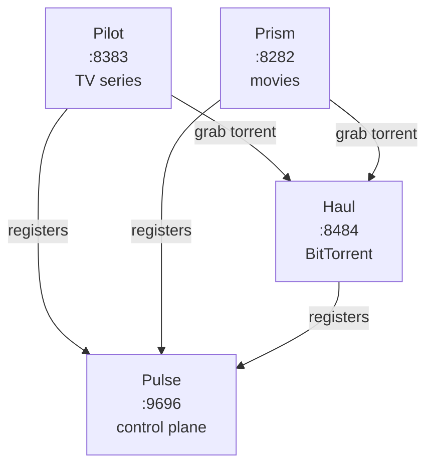

# Beacon Stack — Deploy

Docker Compose deployment for the full Beacon media management stack. One file, four services, three lines to edit.

[](LICENSE)
[](https://docs.docker.com/get-docker/)
[](https://beaconstack.io)

[Quick start](#quick-start) · [Services](#services) · [Configuration](#configuration) · [Enabling VPN](#enabling-vpn) · [Upgrading from Postgres](#upgrading-from-postgres) · [Troubleshooting](#troubleshooting)

---

## What's in the stack

| Service | Purpose |
|---|---|
| **Pulse** | Control plane — central registry; manages indexers, quality profiles, download clients, and shared media-handling settings, and pushes them to every registered service |
| **Pilot** | TV series manager — monitors episodes, scores releases, and kicks off grabs |
| **Prism** | Movie collection manager — edition-aware release scoring, Radarr v3 API compatible |
| **Haul** | BitTorrent client with multi-level stall detection (catches dead torrents that look healthy on paper) and an in-band VPN-aware dashboard |
| _Gluetun_ | Optional — VPN tunnel for Haul. See [Enabling VPN](#enabling-vpn). |
| _FlareSolverr_ | Optional — Cloudflare challenge solver. See [FlareSolverr](#flaresolverr). |

Each service uses an embedded SQLite database in its `/config` volume. No shared Postgres, no init sidecars, no Docker secrets — the stack stands up with `docker compose up -d`.

### Data flow


```mermaid
graph TD
    PULSE["Pulse<br/>:9696<br/>control plane"]

    PILOT["Pilot<br/>:8383<br/>TV series"] -->|registers| PULSE
    PRISM["Prism<br/>:8282<br/>movies"] -->|registers| PULSE
    HAUL["Haul<br/>:8484<br/>BitTorrent"] -->|registers| PULSE

    PILOT -->|grab torrent| HAUL
    PRISM -->|grab torrent| HAUL
```

Pulse is the hub. Pilot, Prism, and Haul all register with it on startup. Pilot and Prism pull indexers, quality profiles, download clients, and shared media-handling settings from Pulse on a 30-second sync (and immediately when Pulse pushes a change). Haul registers itself as a download client, so Pulse hands its address out to Pilot and Prism without any manual UI step. When Pilot or Prism grabs a release, the torrent goes to Haul.

---

## Quick start

**Prerequisites:** Docker Engine 24+ and Docker Compose v2.20+, 2 GB available RAM.

### 1. Clone

```bash
git clone https://github.com/beacon-stack/deploy.git
cd deploy
```

### 2. Edit your media paths

Open `docker-compose.yml` and edit the three `← EDIT` lines to point at real directories on your host:

```yaml
- /opt/media/tv:/tv                  # ← EDIT: your TV directory
- /opt/media/movies:/movies          # ← EDIT: your movies directory
- /opt/media/downloads:/downloads    # ← EDIT: your downloads directory
```

> **Same filesystem rule.** All three host paths must live on the same filesystem. Beacon uses hardlinks + atomic moves for imports — across filesystems it falls back to slow file copies that double your disk usage. The simplest layout is one root with three subdirs (e.g. `/opt/media/{tv,movies,downloads}`).

That's the only required edit. Every other knob in `docker-compose.yml` has a sensible default with a comment explaining what it does.

### 3. Start

```bash
docker compose up -d
```

**Verify:**

```bash
docker compose ps
```

Everything should show `healthy`:

- Pulse → [http://localhost:9696](http://localhost:9696)
- Pilot → [http://localhost:8383](http://localhost:8383)
- Prism → [http://localhost:8282](http://localhost:8282)
- Haul → [http://localhost:8484](http://localhost:8484)

Each service generates its own API key on first run and stores it in its SQLite DB (`./config/<app>/<app>.db`). The key is surfaced in the UI under **Settings → General** with a **Regenerate** button — the same pattern Sonarr and Radarr use. External tools (Homepage, Home Assistant, Radarr v3 clients) read it from there.

---

## Services

| Service | Purpose | Default port | URL |
|---|---|---|---|
| Pulse | Control plane — indexers, quality profiles, shared settings | 9696 | [localhost:9696](http://localhost:9696) |
| Pilot | TV series management | 8383 | [localhost:8383](http://localhost:8383) |
| Prism | Movie collection management | 8282 | [localhost:8282](http://localhost:8282) |
| Haul | BitTorrent client | 8484 | [localhost:8484](http://localhost:8484) |

---

## Connecting the apps

Most of the wiring is automatic. On startup, Pilot, Prism, and Haul each register themselves with Pulse using auto-discovered API keys; you do **not** need to copy keys between UIs or add Haul as a download client by hand.

What flows automatically from Pulse to Pilot and Prism:

- **Indexers** — add a Torznab/Newznab indexer once in Pulse, and Pilot and Prism pick it up within 30 seconds (Pulse also fires a push hook on save, so it's usually instant).
- **Quality profiles** — managed centrally; profiles created in Pulse appear as read-only entries in Pilot/Prism. Local-only profiles still work for per-app overrides.
- **Download clients** — when Haul registers, Pulse auto-creates a download-client entry for it. Pilot and Prism sync that entry into their own download-client lists.
- **Shared media-handling settings** — colon replacement, rename-files toggle, extra file extensions. Set in Pulse, applied to Pilot and Prism on next sync.

The one thing you'll typically do in Pulse's UI on first run is open the Indexers page and add your Torznab/Newznab providers. Everything else is wired by the registration handshake.

> **VPN override note.** When the VPN block is enabled, Haul shares Gluetun's network namespace and other services reach it as `vpn:8484` instead of `haul:8484`. Haul advertises this hostname during registration, so the auto-registered download-client entry resolves correctly without manual edits.

---

## Configuration

`docker-compose.yml` is meant to be **edited in place**. There is no `.env` file and no override file. Every value worth changing lives in the compose file with a comment.

### Media paths

The three paths set in [Quick start](#quick-start) are the most important values. If you run on a NAS or split storage, edit the bind mounts on the host side (left of the colon). Remember the [same-filesystem rule](#2-edit-your-media-paths).

### Ports

Each port-mapping line follows the pattern `"HOST:CONTAINER"`. Change the left number if another service on your host already uses 9696, 8383, 8282, or 8484. The container-side port (right number) doesn't change.

### Config storage

Each service's `/config` directory holds its SQLite database (`<app>.db`), settings, and per-app cached state. Defaults to `./config/<app>` next to the compose file. To move configs to a different volume (faster SSD, NAS share, etc.), edit the volume mount on the host side:

```yaml
volumes:
  - /var/lib/beacon/pulse:/config
```

### Timezone

Default `TZ: UTC` lives in the `x-app-env` YAML anchor near the top of the compose file. Change to any [IANA timezone](https://en.wikipedia.org/wiki/List_of_tz_database_time_zones) — applies to log timestamps and scheduled tasks across all services.

### API keys

Each service generates its API key on first run and persists it to its SQLite DB. The UI exposes it under **Settings → General** with a **Regenerate** button. No init sidecar, no `/run/secrets/*` files, no manual rotation steps — same model as Sonarr/Radarr.

Service-to-service auth happens via Pulse's registration handshake on the private bridge network; you don't need to copy keys between UIs.

---

## Enabling VPN

VPN is off by default. To route Haul's torrent traffic through [Gluetun](https://github.com/qdm12/gluetun):

1. Open `docker-compose.yml`, scroll to the bottom section labelled **OPT-IN: VPN tunnel for Haul**.
2. **Uncomment the entire `services:` block and the `configs:` block** at the bottom (each line starts with `# `). In most editors, select the block and use a "remove leading `# `" macro.
3. Edit `OPENVPN_USER` and `OPENVPN_PASSWORD` with your provider credentials.
4. `docker compose up -d`.

Defaults: PIA / OpenVPN / Netherlands. Gluetun supports [30+ providers](https://github.com/qdm12/gluetun-wiki/tree/main/setup/providers) — change `VPN_SERVICE_PROVIDER`, `VPN_TYPE`, and `SERVER_REGIONS` to match.

For WireGuard, set `VPN_TYPE=wireguard`, uncomment `WIREGUARD_PRIVATE_KEY` / `WIREGUARD_ADDRESSES`, and fill them in.

**To disable** the VPN later: re-comment the block (or just delete it) and `docker compose up -d`. Haul reattaches directly to `beacon-net` on its next start.

---

## FlareSolverr

[FlareSolverr](https://github.com/FlareSolverr/FlareSolverr) is a Cloudflare challenge solver for indexers behind Cloudflare bot protection. Most users don't need it.

```bash
docker compose --profile flaresolverr up -d
```

Then uncomment the `PULSE_FLARESOLVERR_URL` line in the `pulse` service block. Pulse picks it up on next restart and uses it transparently for indexers that return Cloudflare challenges.

---

## Updating

```bash
docker compose pull
docker compose up -d
```

Each service runs its own goose migrations on startup against its SQLite file.

---

## Upgrading from Postgres

If you're on a pre-SQLite Beacon Stack (one that ran a `postgres` container and `init-secrets` / `init-databases` sidecars), use `pg2sqlite` to migrate your data into the new SQLite files.

1. Stop the apps but **leave Postgres running** — it holds your data:

   ```bash
   docker compose stop pulse pilot prism haul
   ```

2. Pull the new images (which expect SQLite) and start them briefly so their goose migrations create the empty SQLite schema:

   ```bash
   docker compose pull pulse pilot prism haul
   docker compose up -d pulse pilot prism haul
   sleep 10
   docker compose stop pulse pilot prism haul
   ```

3. Run `pg2sqlite` against the still-up Postgres. It copies every row, table by table, with the right type coercion (`TIMESTAMPTZ`→RFC3339 TEXT, `JSONB`→TEXT, `BYTEA`→BLOB, `BOOLEAN`→0/1) and bumps the SQLite `sqlite_sequence` high-water marks so subsequent inserts continue past the imported IDs.

   ```bash
   docker run --rm --network deploy_beacon-net \
     -v "$PWD/config/pulse:/sqlite/pulse" \
     -v "$PWD/config/pilot:/sqlite/pilot" \
     -v "$PWD/config/prism:/sqlite/prism" \
     -v "$PWD/config/haul:/sqlite/haul" \
     ghcr.io/beacon-stack/pg2sqlite:latest \
       --pulse-pg "postgres://pulse:$(docker exec init-secrets cat /secrets/pulse.txt)@postgres:5432/pulse_db" \
       --pulse-sqlite /sqlite/pulse/pulse.db \
       --pilot-pg  "postgres://pilot:$(docker exec init-secrets cat /secrets/pilot.txt)@postgres:5432/pilot_db" \
       --pilot-sqlite  /sqlite/pilot/pilot.db \
       --prism-pg  "postgres://prism:$(docker exec init-secrets cat /secrets/prism.txt)@postgres:5432/prism_db" \
       --prism-sqlite  /sqlite/prism/prism.db \
       --haul-pg   "postgres://haul:$(docker exec init-secrets cat /secrets/haul.txt)@postgres:5432/haul_db" \
       --haul-sqlite   /sqlite/haul/haul.db
   ```

   It prints a per-table row count and exits non-zero on any mismatch.

4. Restart the apps on the populated SQLite files:

   ```bash
   docker compose up -d pulse pilot prism haul
   ```

5. Tear down the old Postgres + secrets volumes once you're confident the migration worked:

   ```bash
   docker compose down postgres init-secrets init-databases
   docker volume rm deploy_pgdata deploy_beacon-secrets
   ```

The `pg2sqlite` source lives at [`pg2sqlite/`](./pg2sqlite) in this repo if you want to inspect what it does before running it.

---

## Rebuilding pilot/prism from source (maintainer)

End users **don't need this section** — `docker compose pull` gives you a prebuilt image with the TMDB/Trakt keys already baked in.

If you're a maintainer rebuilding from source, the build needs `PILOT_TMDB_API_KEY` and `PRISM_TMDB_API_KEY` exported in your shell. The Dockerfiles enforce this — a build with empty keys aborts immediately rather than silently producing a 503-on-lookup binary.

Recommended layout: keep the keys in `~/.config/beacon/secrets.env` (outside any repo, mode 0600), source it before building. Example file:

```sh
# ~/.config/beacon/secrets.env  (chmod 600, NEVER commit)
export PILOT_TMDB_API_KEY=...
export PRISM_TMDB_API_KEY=$PILOT_TMDB_API_KEY
export PILOT_TRAKT_CLIENT_ID=...     # optional
```

Rebuild + redeploy via the dev compose (builds from sibling source repos):

```bash
. ~/.config/beacon/secrets.env
docker compose -f docker-compose.yml -f docker-compose.dev.yml build pilot prism
docker compose -f docker-compose.yml -f docker-compose.dev.yml up -d --force-recreate --no-deps pilot prism
```

If you forget the source step, the build fails with:

```
ERROR: TMDB_API_KEY is empty. Refusing to bake a keyless binary.
Set PILOT_TMDB_API_KEY in your shell before rebuilding.
```

Verify the new binary picked up the key:

```bash
docker logs pilot | grep "TMDB metadata client"
# expect: source=default  (key came from build-time bake-in)
```

---

## Troubleshooting

**A service never goes healthy**
- `docker compose logs <service>` names the problem. Common: another process already on the port; the bind-mounted media path doesn't exist; insufficient permissions to write to `./config/<app>`.

**Indexer or download client added in Pulse doesn't show up in Pilot/Prism**
- Pilot and Prism sync from Pulse on a 30-second poll, plus a push hook on save. Wait up to 30 seconds, or check `docker compose logs pilot` / `prism` for `pulse: indexer sync complete` lines. Synced entries appear with a Pulse marker and are read-only in the consumer's UI.

**Pilot or Prism never auto-registered Haul as a download client**
- Haul has to register with Pulse first (look for `pulse: auto-registered download-client service` in `docker compose logs pulse`). If Pulse logs show registration but Pilot/Prism still don't see it, force a sync with `docker compose restart pilot prism`.

**VPN won't connect** (when VPN block is enabled)
- Check `OPENVPN_USER` / `OPENVPN_PASSWORD` in the VPN section.
- Confirm the provider name matches Gluetun's expected value — see the [Gluetun wiki](https://github.com/qdm12/gluetun-wiki/tree/main/setup/providers).
- `docker compose logs vpn`

**`!reset` causing errors when enabling the VPN block**
- You're on Docker Compose < 2.20. Run `docker compose version` to check, then upgrade — `!reset` was added in Dec 2023 and is required for the VPN override to work correctly.

**Haul can't reach Pulse** (VPN block enabled)
- Haul shares Gluetun's network namespace. Gluetun is attached to `beacon-net` and its firewall allow-lists the bridge subnet via `FIREWALL_OUTBOUND_SUBNETS=172.28.0.0/16`.
- If you changed the `beacon-net` subnet, update `FIREWALL_OUTBOUND_SUBNETS` in the VPN block to match.

**Port conflicts**
- If another host service uses 9696, 8383, 8282, or 8484, change the corresponding host port (left of the colon) in the relevant `ports:` block.

**Starting over**
- Stop the stack with `docker compose down`. Delete `./config/<app>/<app>.db` for any service you want to wipe, then `docker compose up -d`. Each service runs goose migrations to recreate an empty schema and generates a new API key on first run.

---

## Development

Clone this repo alongside `pulse/`, `pilot/`, `prism/`, `haul/` (i.e., all under one parent directory). `docker-compose.dev.yml` adds `build: ../<repo>` to each service so each `docker compose up -d --build` rebuilds against your local source. App configs and SQLite DBs land in `./config/<app>` next to the compose file (gitignored), so rebuilds don't wipe your UI settings.

```bash
docker compose -f docker-compose.yml -f docker-compose.dev.yml up -d --build
```

Rebuild a single service after local changes:

```bash
docker compose -f docker-compose.yml -f docker-compose.dev.yml build pilot
docker compose -f docker-compose.yml -f docker-compose.dev.yml up -d pilot
```

---

## Privacy

No telemetry, no analytics, no crash reporting, no update checks. Every Beacon app makes outbound connections only to services you explicitly configure: TMDB for metadata, your indexers, your download clients, your media servers, and (optionally) your VPN tunnel. Credentials stay in your local SQLite databases and bind-mounted config directories.

## License

MIT — see [LICENSE](LICENSE).
